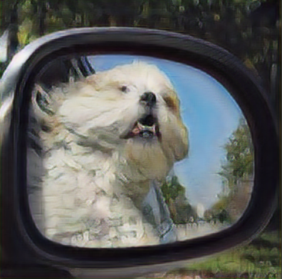

# Single Image Super-Resolution-GAN
This is implementation of the paper **Photo-Realistic Single Image Super-Resolution Using a Generative Adversarial Network**. I have implementated the above paper in keras

[Paper Link](https://arxiv.org/abs/1609.04802)

Although we have breakthroughs in accuracy and speed of single image super-resolution using faster and deeper convolutional neural networks, we still have one largely unsolved problem of recovering the fibner texture details when we super-resolve at large upscaling factors. Most of the methods of super-resolution tries to minimize the mean square error. But the resulted images are perceptually unsatisfying in the sense that they fail to match the fidelity expected at the higher resolution. The paper uses Generative Adversarial Networks (GANs) in order to solve the problem of producing photo realistic super resolution images.

## Implementation Details
I have used coco dataset. A total of 800 high resolution images are used for training purpose. In orginal paper they have 350 thousand images from ImageNet daataset. I have further converted the images of different dimensions into a comman dimension of (384,384,3) using Bicubic kernel. As it was suggested in paper low resolution images are obtaibed by downsampling to a factor of 4 using bicubic kernel. The model was trained for around 31 epochs only because of the non availabilty of high performing hardwares and time constraints although in original paper they have trained the model for around 100k epochs.

**Model Architecture**

##the image is taken from the original paper

## Results
**On Training images**

Low resolution image

high resolution

High redolution using gan

High resolution using Bicubic 

**On Test images**

Low resolution image

high resolution

High redolution using gan

High resolution using Bicubic 

## Acknowledgment

I would like to thanks Deepak Birla for his blog [Blog link](https://medium.com/@birla.deepak26/single-image-super-resolution-using-gans-keras-aca310f33112). It was a great help and the coded was inspired from that.
